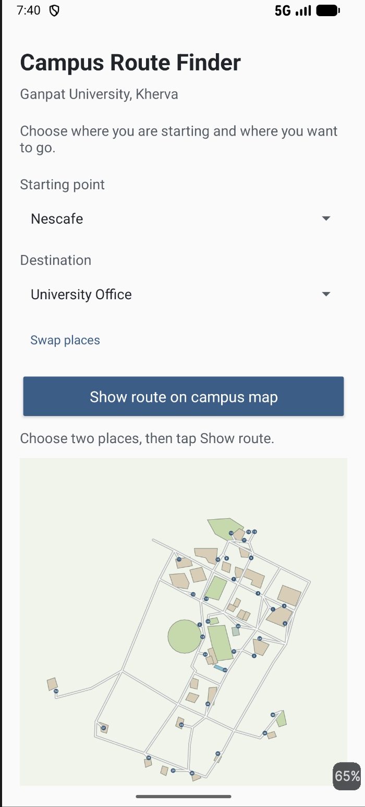
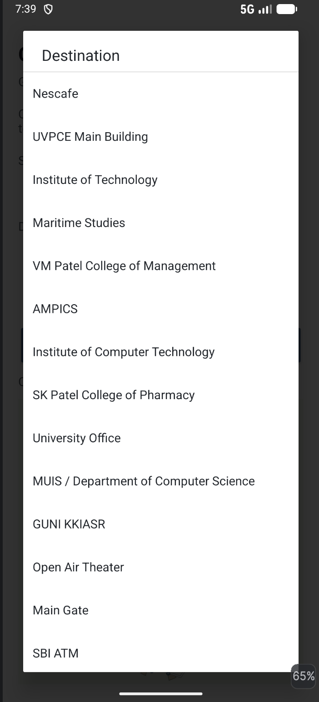
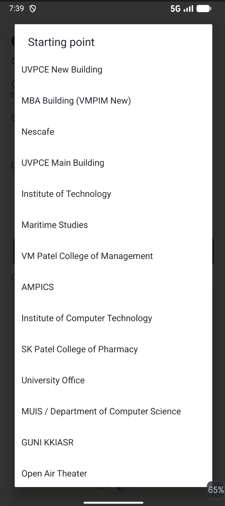
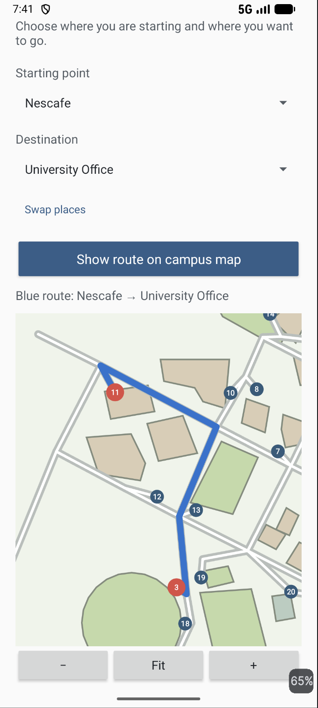
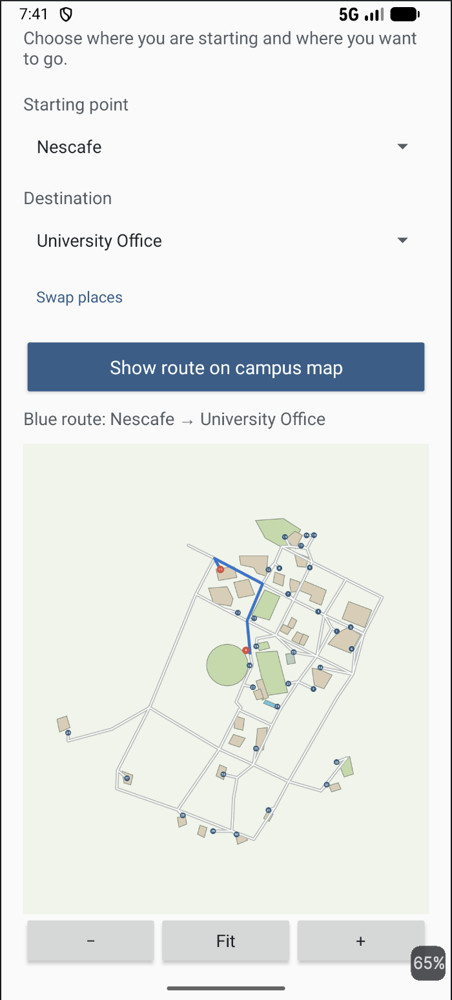
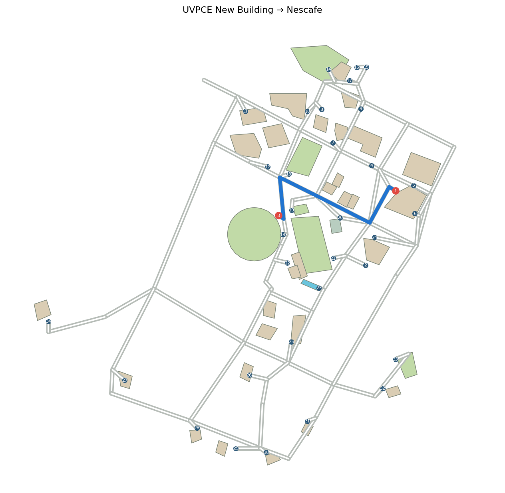
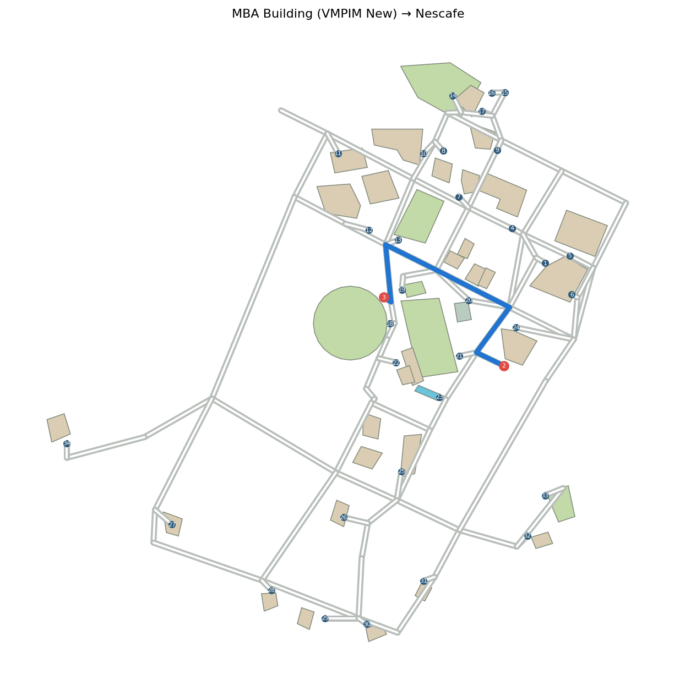

# 24012011037_MAD_Assignment1

# Campus Companion — Ganpat University Route Finder

A small **Kotlin/XML Android application** for finding a route between two places inside **Ganpat University, Kherva**.

The application uses an offline campus map and a local JSON dataset to calculate and display routes between selected locations. It does not require Google Maps, GPS, an API key, a login, or a database.



---

## Objectives

The main objectives of this project are:

- Learn the fundamentals of an Android Activity and XML-based UI.
- Store campus locations in a readable local JSON file.
- Represent campus walkways as a connected graph.
- Draw the calculated route directly on a custom campus map.
- Implement basic map interaction such as zooming, panning, and fitting.
- Preserve application state during screen rotation.
- Build a small offline application that is easy to understand and explain.

---

## Features

- **Several selectable campus places** traced from the supplied campus maps.
- Independent **Starting Point** and **Destination** selectors.
- Scrollable location selection lists.
- **Swap Places** functionality.
- Validation to prevent selecting the same location as both source and destination.
- Blue route displayed directly on the campus map.
- Selected starting and destination locations highlighted in red.
- **Drag / pan** map interaction.
- **Pinch-to-zoom** support.
- `+`, `−`, and **Fit** map controls.
- Numbered campus markers for easier identification.
- Route description showing the selected **From → To** locations.
- State preservation across screen rotation.
- Completely **offline** operation.

---

## Campus Locations

The current dataset contains 34 selectable campus locations. The locations are represented in the local `campus_map.json` file and are used by both the selectors and route engine.

The currently visible locations include:

1. UVPCE New Building
2. MBA Building (VMPIM New)
3. Nescafe
4. UVPCE Main Building
5. Institute of Technology
6. Maritime Studies
7. VM Patel College of Management
8. AMPICS
9. Institute of Computer Technology
10. SK Patel College of Pharmacy
11. University Office
12. MUIS / Department of Computer Science
13. GUNI KKIASR
14. Open Air Theater
15. Main Gate
16. SBI ATM
    etc.

---

# Screenshots

The following screenshots show the main functionality of the application.

## 1. Main Screen

The main screen allows the user to select a starting point and destination before generating a route.


---

## 2. Selecting a Destination

The destination selector displays the available campus locations, including academic buildings, facilities, the main gate, and other important points.



---

## 3. Selecting a Starting Point

The starting-point selector provides the same campus location dataset, allowing the user to independently choose where the route begins.



---

## 4. Route Display

After selecting both locations, the application calculates the connected route and displays it in blue on the campus map. The selected endpoints are highlighted in red.



---

## 5. Expanded Route View

The map can be zoomed into the calculated route to make the individual paths, buildings, and numbered markers easier to inspect.



---

# Application Flow

The basic user flow is:

```text
Open Application
       ↓
Select Starting Point
       ↓
Select Destination
       ↓
Validate Selections
       ↓
Calculate Shortest Route
       ↓
Draw Route on Campus Map
       ↓
Pan / Zoom / Fit Map
```

---

# Example Routes

| Starting Point | Destination | What the App Shows |
|---|---|---|
| UVPCE New Building | Nescafe | <br>Path from the new engineering block through the academic road toward the cricket-ground side |
| MBA Building (VMPIM New) | Nescafe | <br>A different connected path from the MBA/auditorium side toward Nescafe |

The same route engine can be used for any two locations contained in the campus dataset.

---

# How It Works

The application is divided into a few simple components.

### 1. Campus Data

`CampusPlaces.load()` reads:

```text
app/src/main/assets/campus_map.json
```

The JSON file contains the campus locations and their corresponding map/path information.

### 2. Route Calculation

Each campus location is associated with a nearby path node.

The walking paths are represented as a graph:

```text
Place → Nearby Node → Connected Nodes → Destination Node → Place
```

`RouteFinder.find()` uses **Dijkstra's shortest-path algorithm** to find a connected route between the selected locations.

### 3. Map Rendering

`CampusMapView` is responsible for drawing:

- Campus background
- Buildings
- Roads / walkways
- Numbered location markers
- Starting point
- Destination
- Calculated route

The calculated path is rendered as a **blue line**, while the selected endpoints are displayed in **red**.

### 4. User Interface

`MainActivity` connects the UI controls with the underlying data and route engine.

It handles:

- Starting-point selection
- Destination selection
- Swap operation
- Route generation
- Validation
- Map controls
- State restoration

---

# Project Structure

```text
app/
├── src/
│   └── main/
│       ├── assets/
│       │   └── campus_map.json
│       │
│       ├── java/
│       │   └── ...
│       │       ├── MainActivity.kt
│       │       ├── CampusPlaces.kt
│       │       ├── RouteFinder.kt
│       │       └── CampusMapView.kt
│       │
│       └── res/
│           ├── layout/
│           ├── drawable/
│           └── values/
│
docs/
├── LEARN.md
├── preview_uvpce_to_nescafe.png
├── preview_mba_to_nescafe.png
└── screenshots/
    ├── Main_Screen.png
    ├── Select_Destination.png
    ├── Select_Starting_Point.png
    ├── Show_Route.png
    └── Show_Expanded_Route.png
```

---

# Technologies Used

| Technology | Purpose |
|---|---|
| **Kotlin** | Application logic |
| **XML** | Android UI layout |
| **Android Activity** | Main application screen |
| **Spinner** | Location selection |
| **Button** | User actions and map controls |
| **Custom View** | Campus map rendering |
| **JSON** | Local campus data storage |
| **Dijkstra's Algorithm** | Shortest-path calculation |

---

# Offline Architecture

The application intentionally avoids external services.

```text
                    ┌─────────────────────┐
                    │   campus_map.json   │
                    └──────────┬──────────┘
                               │
                               ▼
                    ┌─────────────────────┐
                    │   CampusPlaces      │
                    │   Data Loader       │
                    └──────────┬──────────┘
                               │
                               ▼
User ──→ MainActivity ──→ RouteFinder
             │                 │
             │                 |
             │                 |
             │                 │
             ▼                 ▼
       CampusMapView ←── Calculated Path
             │
             ▼
        Campus Map
```

This means the application can function without:

- Internet connectivity
- Google Maps
- GPS
- API keys
- User accounts
- Remote servers
- Database connectivity

---

# Map Accuracy and Challenges

The campus map was manually traced from the **seven supplied satellite screenshots**.

The screenshots were taken at different zoom levels and partially overlap, so they first had to be interpreted and aligned to construct a consistent schematic representation.

The map attempts to preserve:

- Relative building positions
- Major campus roads
- Walkway connections
- Fields and open areas
- Important campus locations

However, individual entrances and smaller footpaths are approximate.

Therefore, this application should be considered an **educational campus guide rather than safety-critical live navigation**.

The application also does not report invented real-world distances. Route selection is based on the connectivity and relative geometry represented in the local dataset.


---

# Testing

The application was tested for the following scenarios:

| Test | Expected Result |
|---|---|
| Select two different locations | Route is calculated and displayed |
| Select the same location twice | Application prevents invalid route |
| Swap two locations | Starting point and destination are exchanged |
| Generate route | Blue route appears on the map |
| Zoom into route | Map can be enlarged for inspection |
| Zoom out | Map returns to a wider campus view |
| Fit map | Entire campus/map area becomes visible |
| Drag map | User can navigate around the map |
| Rotate device | Selected locations and displayed route are retained |
| Use without Internet | Application continues to function |

---

# Limitations

The current implementation has a few intentional limitations:

- It is limited to the manually mapped campus area.
- The map is schematic rather than GPS-accurate.
- Small entrances and footpaths may not exactly match the physical campus.
- There is no live GPS positioning.
- There is no live traffic or accessibility information.
- Routes are based on the locally defined graph rather than real-time walking conditions.
- The campus dataset must be manually updated if buildings or paths change.

---

# Future Improvements

Possible improvements for a future version include:

- Live GPS-based current-location detection.
- More accurate campus surveying.
- Accessibility-aware routing for wheelchair users.
- Estimated walking time.
- Real-world distance calculation.
- Searchable location names.
- Categories such as **Academic, Food, Administration, Hostel, Sports**, etc.
- Multiple route options instead of only the shortest route.
- Better handling of building entrances.
- Dark mode.
- Favorite / recently used locations.
- Dynamic campus data updates.
- Optional online map synchronization.

---

# Progress

| Date | Update | Challenge |
|---|---|---|
| **2026-09-06** | Corrected the assignment scope and added independent From/To selection | Accurate campus geometry was still missing |
| **2026-09-06** | Traced the supplied overview and close-up maps | Screenshots had different zoom levels and overlapping areas |
| **2026-09-06** | Added offline campus map, 34 places, route engine, map controls and tests | Entrances required further verification |
| **2026-09-16** | Added complete route-selection UI and documented screenshots | Final campus geometry and location naming may require on-campus verification |
| **2026-09-16** | Verified route display, map zooming, panning and endpoint highlighting | Small footpaths remain approximate |

---

# Conclusion

**Campus Companion** demonstrates how a relatively small Android application can combine a structured local dataset, graph-based pathfinding, and custom canvas-based rendering to provide an offline campus navigation experience.

The project focuses on understanding the fundamentals of Android development rather than relying on external navigation services.

It combines:

**Kotlin + XML + JSON + Graph Algorithms + Custom Android View**

into a single offline campus route-finding application.
